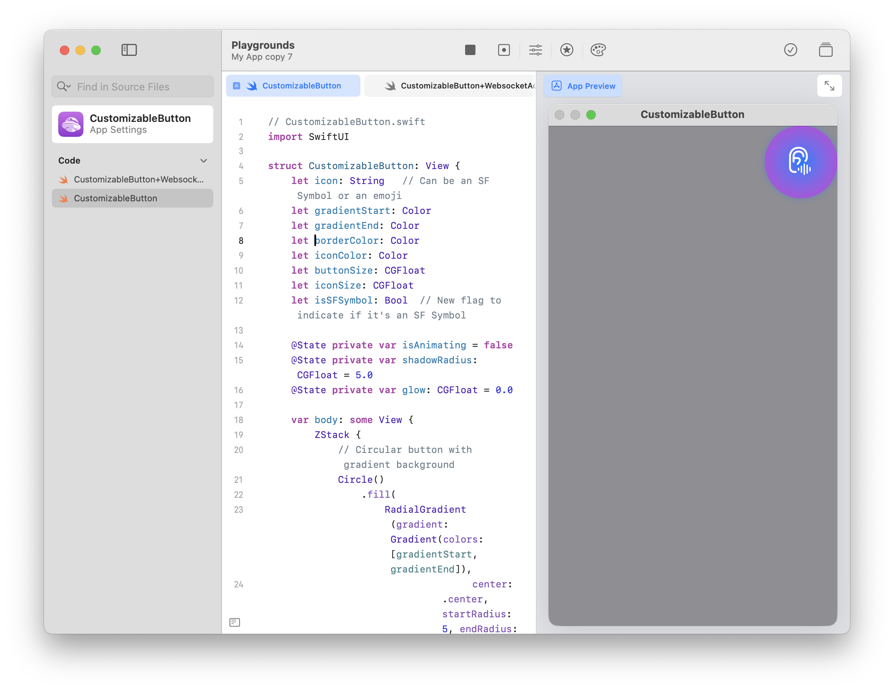

# CustomizableGlowAnimationButton


### Overview
The `CustomizableButton` is a SwiftUI button component designed for flexibility, using parameters that allow the developer to specify visual properties such as the icon, gradient colors, and button size. The button can display SF Symbols or custom images. This guide walks you through adding the button to your project and configuring it to fit different UI designs.

### Integration Steps

1. **Add the `CustomizableButton` to your SwiftUI View:**
   Begin by adding the `CustomizableButton` to your desired view. You can customize it by passing the required parameters during initialization, such as the icon to be displayed, gradient colors, border color, icon size, and whether to use SF Symbols.

   ```swift
   CustomizableButton(
       icon: "ear.badge.waveform",  // Specify the SF Symbol or image name
       gradientStart: .blue,         // Start of the gradient color
       gradientEnd: .purple,         // End of the gradient color
       borderColor: .blue,           // Color of the button's border
       iconColor: .white,            // Color of the icon inside the button
       buttonSize: 120,              // Size of the button
       iconSize: 50,                 // Size of the icon
       isSFSymbol: true              // Set to true if using SF Symbols, false if using a custom image
   )
   ```

   **Parameters:**
   - **`icon` (String)**: The SF Symbol or image name displayed on the button. If using SF Symbols, this should be the name of the symbol (e.g., `"ear.badge.waveform"`).
   - **`gradientStart` (Color)**: The starting color of the gradient background for the button.
   - **`gradientEnd` (Color)**: The ending color of the gradient background for the button.
   - **`borderColor` (Color)**: The color of the button’s border, which can be used to enhance contrast or fit the theme of your UI.
   - **`iconColor` (Color)**: The color applied to the icon or image within the button.
   - **`buttonSize` (CGFloat)**: The overall size of the button (width and height). This controls the size of the button’s clickable area.
   - **`iconSize` (CGFloat)**: The size of the icon or image displayed inside the button. Adjust this to make the icon proportionate to the button size.
   - **`isSFSymbol` (Bool)**: Boolean value to indicate whether you are using an SF Symbol (`true`) or a custom image (`false`).

2. **Placement in the User Interface:**
   The `CustomizableButton` can be placed anywhere in your view, but a typical use case is positioning it within a container like an `HStack` or `VStack` for layout management. For example, to align the button in the top-right corner:

   ```swift
   VStack {
       HStack {
           Spacer()
           CustomizableButton(
               icon: "ear.badge.waveform",
               gradientStart: .blue,
               gradientEnd: .purple,
               borderColor: .blue,
               iconColor: .white,
               buttonSize: 120,
               iconSize: 50,
               isSFSymbol: true
           )
       }
       Spacer()
   }
   ```
   
   **Layout Explanation:**
   - **`Spacer()`** is used to push the button to the right within the horizontal stack (`HStack`) and to push the button up in the vertical stack (`VStack`).
   - This places the button at the top-right corner of the screen.

3. **Custom Button Action:**
   To add functionality to the button, you can attach gestures like `.onTapGesture` or use a `Button` wrapper to assign actions when the button is tapped.

   Example of adding a tap gesture to toggle a state:
   ```swift
   CustomizableButton(
       icon: "ear.badge.waveform",
       gradientStart: .blue,
       gradientEnd: .purple,
       borderColor: .blue,
       iconColor: .white,
       buttonSize: 120,
       iconSize: 50,
       isSFSymbol: true
   )
   .onTapGesture {
       // Your action here
       print("Button tapped")
   }
   ```

   Alternatively, you can use a SwiftUI `Button` for more advanced functionality:
   ```swift
   Button(action: {
       // Your action here
       print("Button tapped")
   }) {
       CustomizableButton(
           icon: "ear.badge.waveform",
           gradientStart: .blue,
           gradientEnd: .purple,
           borderColor: .blue,
           iconColor: .white,
           buttonSize: 120,
           iconSize: 50,
           isSFSymbol: true
       )
   }
   ```

4. **Toast Notification Integration (Optional):**
   If you want to trigger a notification or toast when the button is pressed, use a state to control the appearance of a notification or alert. Here’s an example of how to add a toast message when the button is tapped:

   ```swift
   @State private var showToast: Bool = false
   
   CustomizableButton(
       icon: "ear.badge.waveform",
       gradientStart: .blue,
       gradientEnd: .purple,
       borderColor: .blue,
       iconColor: .white,
       buttonSize: 120,
       iconSize: 50,
       isSFSymbol: true
   )
   .onTapGesture {
       showToast = true
       // Dismiss the toast after a short delay
       DispatchQueue.main.asyncAfter(deadline: .now() + 3) {
           showToast = false
       }
   }
   
   if showToast {
       VStack {
           Spacer()
           Text("AI Socket is ready!")
               .font(.headline)
               .padding()
               .background(Color.blue)
               .cornerRadius(10)
               .foregroundColor(.white)
           Spacer().frame(height: 50) // Adds space from the bottom edge
       }
   }
   ```

   **Key Points:**
   - **`showToast`**: A boolean state controls the visibility of the toast.
   - **`DispatchQueue.main.asyncAfter`**: This is used to auto-dismiss the toast after 3 seconds.

---

### Notes for Extending the Button

- **Custom Icons**: If you plan to use custom icons instead of SF Symbols, set `isSFSymbol` to `false`, and pass the name of the custom image as the `icon` parameter. Ensure your images are available in the asset catalog of your project.

- **Button Action Flexibility**: The button itself does not enforce specific actions. You can easily wrap it inside a `Button` or attach gestures like `.onTapGesture`, making it suitable for a wide range of interactive functionalities.

- **Styling Considerations**: While the button supports a gradient background and border color, you can further customize its appearance by adjusting the corner radius, shadow properties, or even embedding it within other SwiftUI components like `ZStack` or `HStack` for more complex layouts.

- **Accessibility**: If you are using SF Symbols, consider their inherent accessibility features. You might also want to attach additional accessibility modifiers to ensure the button is screen-reader friendly:
   ```swift
   .accessibility(label: Text("Start Audio Processing"))
   ```

- **Animations**: Feel free to enhance the button’s interaction by adding animations. For example, you can add scale effects or rotation effects when the button is tapped to give the user a more dynamic experience.